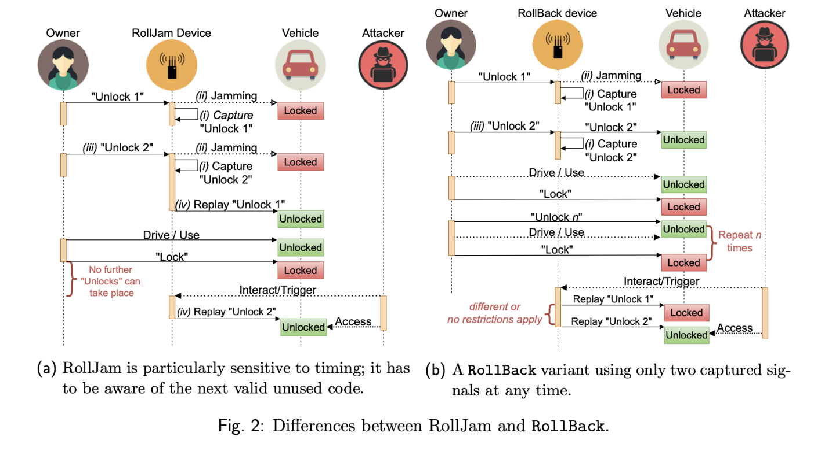
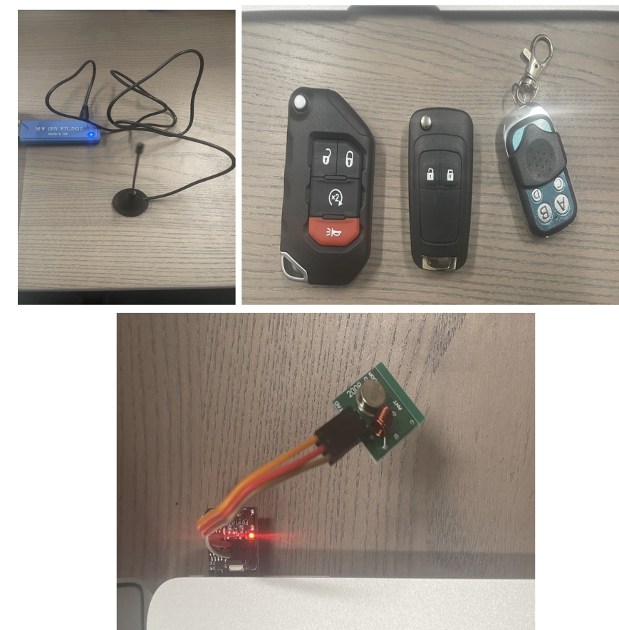

# Rollback: Access your car without key
[Replay Guardian: Unleashing Real-Time Car Access Without Keys](https://docs.google.com/presentation/d/e/2PACX-1vSgG_BwKBO6aSGT3zO4F7QAdDvUY0IcXeUB9Mc21_h1XsCaDoyKpCQ-uAHmMjHbROocNk92ELYahE4P/pub?start=true&loop=false&delayms=3000)
The key idea is to unlock a car without using the key, which we got from this blackhat paper - [RollBack: A New Time-Agnostic Replay Attack Against the Automotive Remote Keyless Entry Systems](https://i.blackhat.com/USA-22/Thursday/US-22-Csikor-RollBack-A-New-Time-Agnostic-Replay-Attack.pdf)

**CPS project rollback code**
Code: keys-monitor.ino

#### Project Overview
Replay Guardian refers to a specific type of security vulnerability associated with keyless entry systems in
vehicles. This attack exploits the wireless communication between a key fob and a vehicle by jamming
and intercepting the signals exchanged during the key fob unlocking process. This project aimed to
develop a functional prototype capable of recording rolling codes and executing the RollBack attack
against car keyless entry systems. Our goal was to gain insights into the learning process of key fobs,
analyze the vulnerability of rolling code systems, and develop countermeasures against the RollBack
attack by implementing an attack.

#### Rollback Systems Overview
Remote Keyless Entry (RKE) systems utilize disposable rolling codes to bolster security, ensuring the
generation of unique codes with each key fob button activation and minimizing vulnerability to
straightforward replay attacks. Despite this, a previously demonstrated exploit named RollJam showcased
the ability to compromise all rolling code-based systems by employing a meticulous sequence of signal
jamming, interception, and replay. This method allows attackers to discern subsequent valid unlock
signals. It is crucial to note that RollJam requires continuous deployment to remain effective; otherwise,
captured signals lose validity when the key fob is used without RollJam.
In response to this security challenge, we came to know about RollBack [1], a novel
replay-and-resynchronize attack applicable to the majority of contemporary RKE systems. Unlike
RollJam, RollBack operates without the need for jamming, requires signal capture only once, and can be
exploited at any future time. This time-agnostic feature is particularly appealing to attackers, especially in
scenarios such as car-sharing or renting, where access to the key fob is easily attainable. It is essential to
acknowledge that while RollJam compromises virtually any rolling code-based system, certain vehicles
may have additional anti-theft measures safeguarding against malfunctions, including RollBack.
The Replay Guardian project addresses a specific security vulnerability associated with keyless entry
systems in vehicles. This attack exploits wireless communication between a key fob and a vehicle by
jamming and intercepting signals during the unlocking process. Our project's goal was to develop a
functional prototype capable of recording rolling codes and executing the RollBack attack against car
keyless entry systems. Through this endeavor, we aimed to gain insights into the key fob learning process,
analyze the vulnerability of rolling code systems, and propose countermeasures against the RollBack
attack by explaining a robust defense mechanism.

#### Motivation
Since the advent of automobiles over a century ago, vehicles have undergone major advancements to
improve efficiency, versatility, and safety. A key innovation occurred in the 1980s with the integration of
electronic control units (ECUs), ushering the transition from mechanical to digital systems for enhanced
diagnostics, stability, and comfort. However, the shift also introduced new cyber vulnerabilities by
expanding potential attack surfaces.
Among the early digitized features contributing to both convenience and amenities were remote keyless
entry (RKE) systems, which revolutionized access control by eliminating physical keys. As RKE systems
operate on wireless signals, encryption was deployed to protect against eavesdropping and tampering.However, many current systems rely on static codes, making them susceptible to replay attacks where an
adversary can capture and later reuse a signal to unlock the vehicle.
To address such threats, countermeasures like rolling codes were developed to ensure exclusive single-use
codes with each key fob press. However, the 2015 emergence of RollJam demonstrated that even rolling
code defenses could be defeated by savvy attackers who carefully jam, capture, and replay signals for
unauthorized access.
While impactful, RollJam had limitations in continuously deploying attacks or addressing scenarios where
vehicle owners reused access. This project puts forward Replay Guardian, which is a functional prototype
of Rollback, a time-agnostic replay attack that initiates a rollback mechanism to restore the validity of
previously captured signals. By capturing consecutive RKE signals, Replay Guardian can replay
instructions like those for persistent access even in shared vehicle settings. Replay Guardian thus
highlights the pressing need to reassess and bolster security in modern remote entry systems.
##### Rolling Code Security in Keyless Entry Systems: A diagram depicting the interaction between owner,
remote, vehicle, and receiver during a rolling code transmission.
Key Components:
 - Owner: Has a remote control that sends signals to the vehicle.
 - Vehicle: Has a receiver that receives signals and unlocks doors and garages.

How the Rolling Code Works:
1. Owner presses the button: Remote generates a new code.
2. Code sent to the receiver: The receiver checks the code's validity.
3. Valid code: Receiver unlocks doors.Attacker Exploitation:
Attacker Exploitation:
Capturing a remote signal and replaying it to unlock doors.

Rolljam:
○ Owner presses "Unlock 1".
○ Attacker jams the signal and captures "Unlock 1".
○ Owner presses "Unlock 2".
○ Attacker jams the signal and captures "Unlock 2".
○ Attacker replays "Unlock 1" to unlock the car.
Rollback:
○ Owner presses "Unlock 1".
○ Attacker captures "Unlock 1".
○ Owner presses any other button (e.g., "Lock").
○ Attacker can replay "Unlock 1" at any time to unlock the car.
Overall, this diagram shows that Rollback is a more powerful attack than Rolljam because it is less
time-sensitive, requires fewer captured codes, and can be reused.

#### Background:
The evolution of keyless entry systems reflects a transition from traditional button-based operations, such
as RKE, to more advanced and convenient solutions, like PKES. While RKE provides users with remote
control capabilities through manual initiation, PKES introduces a more seamless and automatic approachbased on user proximity. However, the convenience of these systems comes with security challenges. In
this context, our focus on this project is on the vulnerabilities and attacks associated specifically with
RKE systems. Understanding the intricacies of RKE systems is essential for addressing security concerns
and developing effective countermeasures in the evolving landscape of automotive technology.
Remote Keyless Entry is a unidirectional authentication system integral to modern vehicles. Users interact
with RKE by pressing buttons on a key fob and initiating actions such as locking or unlocking the vehicle.
The key fob emits radio frequency (RF) signals, typically in frequency bands like 315 MHz, 433 MHz, or
868 MHz, depending on geographic location.
A passive keyless entry (PKES) operates automatically when the key fob is near the vehicle. PKES
incorporates bi-directional challenge-response communication for enhanced authentication. Owners with
the correct key fob can unlock and automatically lock the car by simply pulling the door handle or
walking away, respectively. PKES key fobs often integrate RKE functionality as a fail-safe or secondary
mechanism.

Remote Keyless Entry (RKE) systems date back to the 1970s, marked by early motorized garage openers
that employed static codes transmitted in "plain text" over the air for actions like opening and closing.
However, this simplicity made these systems susceptible to attacks, as adversaries could easily intercept
and replay signals to unlock garage doors. This system is vulnerable, according to [1], and we proved it
with our implementation of Replay Guardian.
The implementation of rolling code technology ensures the uniqueness of every key fob signal
transmission. With each button press, a 16-bit counter in both the key fob and the vehicle increments,
ensuring synchronization. A button press is deemed valid only if both counters are in sync. Subsequently,
each party increments its counter to align for the subsequent button press. Consequently, if an attacker
captures a valid signal sent from the key fob and received by the vehicle, with the key fob's counter (Ck)
at 'n,' and replays it, the signal is rejected by the vehicle's receiver. This rejection occurs because the
vehicle's counter (Cv) surpasses Ck, adhering to the relation Cv = (n + k), where 'k' is a positive
increment. This counter-synchronization mechanism is a crucial defense, preventing replay attacks on
rolling code-based RKE systems.
Cv: represents the counter value maintained by the vehicle (receiver) to keep track of received signals
from the key fob.
Ck: the counter value in the key fob, indicating the number of times a button has been pressed.

#### Technical Implementation
For this project, we leverage Software Defined Radio (SDR) devices, which are equipped with wireless
receivers and transmitters that can be dynamically configured through software, allowing precise tuning
to specific frequency domains for signal analysis. To disrupt or jam frequencies using an SDR device,
attackers have a diverse range of options, depending on their expertise and preferences. Notably, jamming
is not a strict requirement for the success of the RollBack attack, differentiating it from some other
attacks.
**We utilized the following equipment for our project:**
1. FS1000A Transmitter (433 MHz and 315 MHz): This is a low-cost radio frequency (RF)
transmitter commonly used in DIY projects. It operates in the 433 MHz and 315 MHz frequency
bands and can be employed for wireless communication.2. Digispark Module (ATTINY85): The Digispark Module is based on the ATTINY85
microcontroller. It is a compact and versatile module suitable for various applications, including
low-power and compact projects.
3. RTL-SDR (25 MHz–1760 MHz): RTL-SDR is a popular and inexpensive software-defined radio
receiver that covers a broad frequency range from 25 MHz to 1760 MHz. It is widely used for
exploring and monitoring different signals, making it a valuable tool in the analysis of wireless
communication.
4. EK-TM4C123GXL evaluation kit: This refers to a vehicle emulation evaluation kit, a
comprehensive package used by Mitre eCTF to facilitate testing and evaluation of the emulated
vehicle and related components.
5. Flipper Zero: Flipper Zero is a versatile, pocket-sized device with various functionalities,
including radio signal analysis and manipulation. It features an open-source design and can be
programmed for different tasks, making it suitable for security research and penetration testing.
These components were used to implement the following functionalities:
The following functionalities not only exemplified the technical prowess of our project but also offered a
profound exploration into the vulnerabilities inherent in modern keyless entry systems. The development
of specialized code for rolling code capture empowered us to capture and store signals emitted by key
fobs, paving the way for a detailed analysis of dynamic patterns and variations within rolling codes.
1. Rolling Code Capture:
a. Developed dedicated code to proficiently capture signals emitted by key fobs during lock
and unlock operations.b. Enabled the systematic storage of rolling codes, facilitating an in-depth analysis of their
dynamic patterns and variations.
2. Rolling Back Attack Simulation:
a. Utilized the captured rolling codes to orchestrate a simulated RollBack attack,
showcasing the inherent vulnerability in keyless entry systems.
b. Demonstrated the potential for unauthorized access by replaying rolling codes in a
specific sequence, emphasizing the susceptibility of car keyless entry mechanisms.
3. Key Fob Analysis:
a. Engaged in the reverse engineering of key fobs to decipher their internal communication
protocols.
b. Explored the intricacies of key fob functionality, aiming to identify and comprehend
potential security weaknesses in their communication mechanisms.
These functionalities collectively provided a comprehensive exploration of keyless entry system
vulnerabilities, highlighting the critical role played by the implemented components in understanding,
simulating, and analyzing security risks associated with contemporary automotive access technologies.

#### Results and Analysis
SDR stands for Software-Defined Radio. It's a radio communication system where components that were
traditionally implemented in hardware (e.g., mixers, filters, and amplifiers) are generally implemented
using software on a personal computer or embedded system. RTL-SDR is a Realtek RTL2832U-based
DVB-T (Digital Video Broadcasting—Terrestrial) USB receiver that uses software-defined radios. These
devices were originally designed for receiving digital television signals but were later discovered to have
a much wider range of applications in software-defined radio. We used this RTL-SDR to receive the data
from the key fobs.After we collected the codes from the key fobs, we sent the codes using the transmitter frequently after a
few microseconds. There are two types of codes: one will tell the vehicle to lock or unlock the car, and the
other will contain the hash.
The FS1000A is a wireless transmitter module designed to operate at either 433 MHz or 315 MHz. It is
commonly used in remote control applications and wireless communication systems. In our case, we used
it to capture the 433 MHz frequency from the keys. The FS1000A has been attached to pin 2 of
DigiSpark, and that is used to transmit the signals. This is defined in the code, as shown below.
The Digispark is a development board based on the ATTINY85 microcontroller. It's a compact and
versatile board with a USB interface for programming and communication. While sending the code using
a transmitter, it is sent via pulses. To do that, I created a pulse for each and every hash codes which is
captured by using the RTL-SDR. Using the following function, we are sending the data to the vehicle.

**Our project successfully achieved the following:**
Our project's accomplishments not only include the thorough exploration of vulnerabilities in keyless
entry systems but also extend to the practical implementation and execution of the RollBack attack. Byproviding valuable insights into vulnerabilities and proposing effective countermeasures, our efforts
contribute significantly to the advancement of keyless entry system security.
1. Exploration of Implementation and Transmission Protocol Weaknesses:
a. Thoroughly investigated potential vulnerabilities inherent in the implementation and
transmission protocols of keyless entry systems.
b. Conducted an in-depth analysis to identify weaknesses that could be exploited in these
systems.
2. Recording and Analysis of Rolling Codes:
a. Developed methodologies for recording rolling codes transmitted by various key fobs.
b. Systematically analyzed the captured rolling codes to gain insights into their patterns and
potential vulnerabilities.
3. Successful Implementation and Execution of the Rollback Attack:
a. Successfully devised and implemented the RollBack attack on specific vehicle models,
showcasing the feasibility of compromising rolling code-based keyless entry systems.
b. Executed the attack to demonstrate its effectiveness in real-world scenarios.
4. Insights into Vulnerabilities and Countermeasures:
a. obtained valuable insights into the vulnerabilities inherent in rolling code systems,
shedding light on potential points of exploitation.
b. Identified and proposed effective countermeasures to enhance the security of keyless
entry systems against such attacks.
5. Development of a Prototype System:
a. Designed and implemented a prototype system capable of effectively demonstrating the
rollback attack and its implications.
b. The prototype system serves as a practical tool for showcasing the security risks
associated with rolling code-based keyless entry systems.

##### Challenges and Mitigation Strategies
During the project, we encountered the following challenges:
We encountered noteworthy challenges that enriched our problem-solving capabilities. Facing access
limitations to specific vehicles and their key fobs prompted us to adopt creative approaches, overcoming
hurdles and broadening the scope of our analysis.
1. Access Limitations for Specific Vehicles and Key Fobs:
a. We encountered restrictions in gaining access to certain vehicles and their associated key
fobs, limiting the scope of our analysis.
b. Overcome challenges related to restricted access by adopting alternative approaches to
gather relevant data and insights.
2. Complexity in Reverse-Engineering Key Fobs:
a. Faced complexities in the reverse-engineering process of key fobs are primarily attributed
to the scarcity of comprehensive documentation and schematics.
b. Successfully addressed the challenges posed by limited information by employing
innovative methodologies in reverse engineering endeavors.
3. Responsible Disclosure of Vulnerabilities and Security Risks:
a. Navigated the intricacies of responsibly disclosing identified vulnerabilities and potential
security risks.
b. We ensured that our findings were communicated ethically and in adherence to
established protocols, prioritizing the responsible disclosure of sensitive information.To address these challenges, we implemented the following strategies:
Our strategic approach involved leveraging open-source tools and online resources to navigate the
intricacies of reverse-engineering key fobs. While pursuing the cross-compilation of MITRE eCTF Tools
for a car simulation model on the arm64 bit, we encountered a roadblock due to the unavailability of
Stellaris ICDI Drivers, showcasing our adaptability in integrating alternative solutions.
1. Utilization of Open-Source Tools and Online Resources:
a. We cross-compiled the MITRE eCTF Tools to build a car simulation model for the arm64
bit. But we couldn’t finish doing it because it requires Stellaris ICDI Drivers, which we
didn’t have.
b. Leveraged open-source tools and tapping into online resources to streamline the
reverse-engineering process of key fobs.
c. Demonstrated adaptability by integrating innovative solutions available in the public
domain to compensate for limited documentation.
2. Adherence to Responsible Disclosure Principles:
a. Prioritized responsible disclosure principles to ensure the ethical handling of identified
vulnerabilities.
b. Directly communicated discovered vulnerabilities to manufacturers, adhering to
established guidelines for responsible disclosure within the realm of automotive security.

##### Future Work and Recommendations:
Based on our findings, we advocate for future work that encompasses the development of robust
countermeasures against the RollBack attack within keyless entry systems. This entails creating and
deploying resilient solutions to fortify security protocols while addressing emerging threats and
minimizing susceptibility. Additionally, we emphasize the importance of standardizing rolling code
algorithms, urging the enhancement of security measures. Collaborative efforts with industry
stakeholders, security experts, and standardization bodies are crucial to refining existing algorithms and
fortifying the foundation of keyless entry systems against potential vulnerabilities.

**Based on our findings, we recommend the following future works:**
1. Development of Robust Countermeasures:
a. Undertake the creation and deployment of resilient countermeasures designed to thwart
the RollBack attack within keyless entry systems.
b. Explore innovative solutions and technologies to fortify security protocols, minimizing
the susceptibility of keyless entry systems to emerging threats.
2. Standardization and Enhancement of Rolling Code Algorithms:
a. Advocate for the standardization of rolling code algorithms, emphasizing the need for
enhanced security measures.
b. Collaborate with industry stakeholders, security experts, and standardization bodies to
refine existing algorithms, fortifying the foundation of keyless entry systems against
potential vulnerabilities.
3. Collaborative Initiatives with Manufacturers and Researchers:
a. Foster collaborative partnerships with automotive manufacturers, security researchers,
and industry experts.
b. Establish forums for knowledge sharing, facilitating collaborative research initiatives, and
collectively developing best practices to bolster the security posture of keyless entry
systems.

#### Conclusion
The RollBack attack findings underscore the importance of ongoing research and development in
automotive security. As technology evolves, so do potential threats, necessitating continuous efforts to
stay ahead of malicious actors. This project not only contributes to the understanding of specific
vulnerabilities but also emphasizes the broader need for proactive measures to bolster the overall security
landscape within the automotive industry.
Also, this project successfully investigated and demonstrated the RollBack attack against car keyless
entry systems. We gained valuable insights into the vulnerabilities of rolling codes and developed a
prototype system for further analysis and countermeasure development. By addressing the identified
challenges and implementing the proposed recommendations, it is possible to improve the security of
keyless entry systems and protect vehicles from unauthorized access.
Furthermore, the successful demonstration of the RollBack attack serves as a call to action for
manufacturers, encouraging them to implement more advanced mechanisms and security protocols in
keyless entry systems. As vehicles become increasingly connected and autonomous, the importance of
robust security measures cannot be overstated.
#### References:
1. RollBack: A New Time-Agnostic Replay Attack Against Automotive Remote Keyless Entry
Systems.
2. MITRE eCTF Tools
